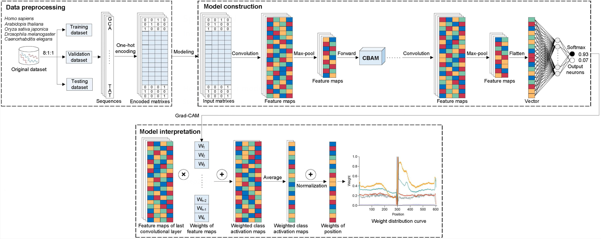

# SpliceSCA N

## Introduction
SpliceSCAN is a novel method to predict canonical Splice Sites via integration of AttentioN mechanism with Convolutional neural network (CNN). The overview of SpliceSCAN is as belows:


In our work, we trained ten models to predict donor and acceptor sites for five organisms: Homo sapiens, Arabidopsis thaliana, Oryza sativa japonica, Drosophila melanogaster and Caenorhabditis elegans.

## How to use our models to predict splice sites?
### Step1: spliting reads

Input parameters: type (donor or acceptor), input (fasta filename) and output (spliting filename), then run for spliting reads into sequences with length of 602. Eg:

```bash
python split.py type=donor input=./data/testData.fa output=./splitReads/split_testData.csv
```

### Step2: encoding

Input parameters: input (spliting filename) and output (encoding filename), then run for sequence encoding ([1,0,0,0] for A, [0,1,0,0] for C, [0,0,1,0] for G, [0,0,0,1] for T). Eg:

```bash
python encode.py input=./splitReads/split_testData.csv output=./encoding/encoding_testData.csv
```

### Step3: predicting splice sites

Input parameters: type (donor or acceptor), organism (A_thaliana, C_elegans, D_melanogaster, H_sapiens or O_sativa_japonica) input (encoding filename), and output (predicting filename), then run for predicting splice sites. Eg:

```bash
python predict.py type=donor organism=H_sapiens input=./encoding/encoding_testData.csv output=./predictResults/predict_testData.csv
```